# 快速上手（quick start）指南

furnace惊人地可变可定制化，但是它也可能比较吓人，甚至是对于那些已经熟悉tracker的人来说也是如此。这个快速上手指南将会让你上路制作你梦想中的芯片音乐！如果你是萌新，这个教程大概耗时1小时。Furnace is amazingly versatile, but it can also be intimidating, even for those already familiar with trackers. this quick start guide will get you on the road to making the chiptunes of your dreams! if you're a beginner, it will probably take about an hour from start to finish.

这个教程做出以下假定this guide makes a few assumptions:

* 你已经安装好furnace并且知道从哪里找到它附带的示例文件。找到`quickstart.fur`但是先别打开它。you've already installed Furnace and know where to find the demo files that come with it. look for `quickstart.fur` but don't open it yet.
* 你还没有改变任何配置或布局。它应该以默认的世嘉genesis系统启动。you haven't changed any configuration or layout yet. it should start up with the default Sega Genesis system.
* 你使用一把PC的键盘，美国英语、QWERTY布局。Mac用户应该已经知道怎么替代<kbd>Ctrl</kbd>和<kbd>Alt</kbd>按键了。you're working with a PC keyboard, US English, QWERTY layout. Mac users should already know the equivalents to the `Ctrl` and `Alt` keys.
* 你能顺利接受快捷键。如果不行，许多功能可以用按钮和菜单完成。但请先试试快捷键，它可以让编曲的工作流更快速。you're comfortable with keyboard shortcuts. if not, a lot of this can also be done using buttons or menus, but please try the keyboard first. it's worth it to smooth out the tracking workflow.

如果一个陌生词汇绊住了你，或者你需要更多关于它的解释，请查阅和[基本概念](concepts.md)和[词汇表](glossary.md)文档。if an unfamiliar term comes up or you need more clarification on a term, refer to the [basic concepts](concepts.md) and [glossary](glossary.md) docs.

如果你还不熟悉ImGui风格的界面，看看[用户界面组成](../2-interface/components.md)文档。如果界面被弄乱了——有的组件移到了够不到的地方，什么窗口或选项卡被意外关闭了，可以在‘settings’设置菜单里面的‘reset layout’选项复位到最开始的样子。if you're not already familiar with the ImGui style of interface, you might want to take a quick glance at the [UI components](../2-interface/components.md) documentation. if at any point something goes wrong with the interface – something gets moved to where it's inaccessible, something closes a window or tab unexpectedly, or the like – it can always be reverted to its original state by selecting "reset layout" from the "settings" menu.

说了这么多，快打开程序开始吧！with all that said, start up the program and let's get going!

## 我打开furnace了，然后呢？I've opened Furnace – now what?

第一次打开furnace，界面应该长得像这样。如果不太合适，拖拽这些组件之间的分界线让大小变得合适。on starting Furnace for the first time, the interface should look like this. if it's not quite right, drag the borders between sections until it approximately matches.

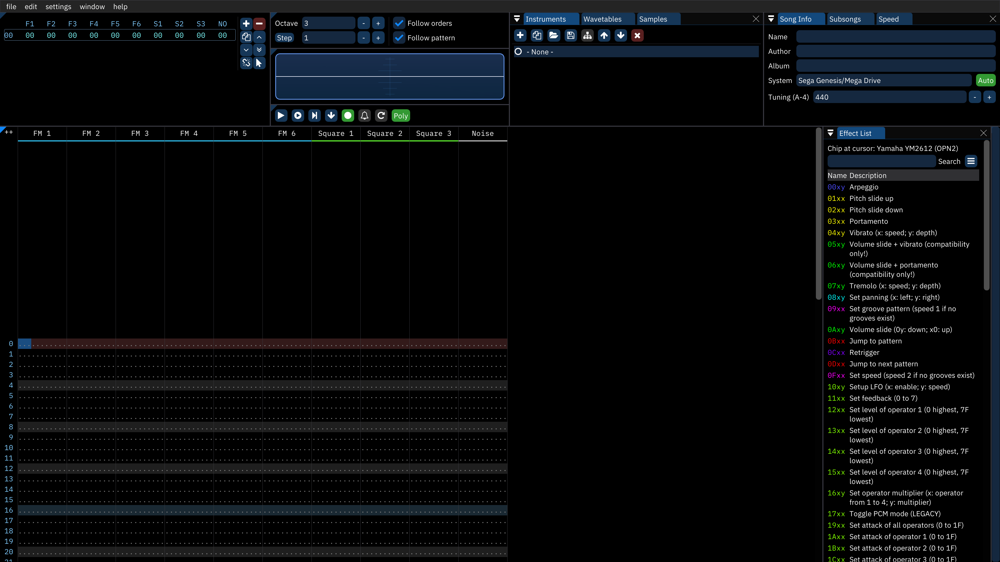

画面上有很多组件，但是furnace的界面的核心部分是**pattern视图**——左下方这张大表格。there's a lot going on, but the most prominent part of Furnace's interface is the **pattern view** – the spreadsheet-like table that takes up the bottom-left.

点一下，把光标移动到这个视图里面的某个位置。它会显示成一个深不深、浅不浅的蓝色的高亮。试着用上下方向键在周围移动一下。`PgUp`和`PgDn`移动起来更快速。`Home`和`End`分别会让你移动到第一行与最后一行。垂直方向的轴代表时间。在编辑与播放过程中，整个视图相对带有高亮的一行滚动，这一行总是保持在竖直方向的最中间，这一行就是**播放头playhead**。click to place the cursor somewhere in this view. it will appear as a medium-blue highlight. try moving around with the up and down arrow keys. also try the `PgUp` and `PgDn` keys to move around faster. the `Home` and `End` keys quickly move to the first and last rows. the vertical axis represents time. during editing and playback the view scrolls around a highlighted row that stays put in the center; this is called the **playhead**.

现在试试左右方向键，它们让你能在不同列之间移动。按两次`Home`和`End`键分别会把你传送到第一列或最后一列。你做好后，按两次`Home`可以回到左上角。now try the left and right arrow keys to move between columns. pressing `Home` or `End` twice will shuttle you to the first or last column, respectively. when you're done, hit `Home` twice to return to the top-left.

演奏一下！音符被像钢琴一样安排在键盘上。从底端一行的键开始(`ZXCVBNM`)。它们听起来应该像C大调音阶的音，就像钢琴的白键。向上一列，恰好是钢琴的黑键(`SD GHJ`)向上移动两行，是相同的布局，只不过高一个八度（白键`QWERTYU`,黑键`23 567`）这两行向右延伸到下一个八度。let's play a little! notes are arranged on the keyboard rather like a piano. start with the bottom row of letters (`ZXCVBNM`). they should sound out the notes of the C major scale, like the piano's white keys. above that, we have the accidentals where the piano's black keys would be expected (`SD GHJ`). play with these, then move two rows up to find the same arrangement but one octave higher (white keys on `QWERTYU`, black keys on `23 567`). these rows also extend a little further to the right into the next octave.

要想改变键盘上代表的是哪个八度，就用数字小键盘上的`/`和`*`键。（你没有数字小键盘的话，这些键也可以被重映射。[键盘](../2-interface/keyboard.md)文档有介绍。）作为替代，在界面上方离左面大概三分之一的地方有个八度选择栏。to change which octaves are represented on the keyboard, use the `/` and `*` keys on the numeric pad. (if you don't have a numeric pad, these keys can be remapped; the [keyboard](../2-interface/keyboard.md) doc explains how.) as an alternative, there's an octave selector at the top of the interface, a third of the way in from the left.

现在按空格从播放模式转为编辑模式。光标所在的列——就是之前的播放头——会变成暗红色。区分我们处于播放还是编辑模式的另一方法是通过pattern视图上方中间的播放/编辑控制栏；确保‘录制’按钮是打开的。（绿色）now press the space bar to change from play to edit mode. the row the cursor is on will change to dark red – the playhead mentioned earlier. another way to tell what mode we're in is via the play/edit controls just above the pattern view in the center; make sure the "record" button is on.

现在试着演奏几个音符，它们应该在pattern视图中一个挨一个地排列。now try playing some notes; they should appear in the pattern view, one after another.

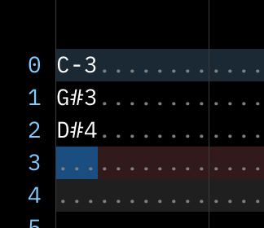

每个**通道channel**都是彼此间由竖线分割开的一组列，它们在最顶上有名字标识。每个通道同时只能播放一个音符。要想听到这个动态，把光标移动回到顶端按`Enter`或`Return`以开始播放。你应该听到你输入的音符被快速回放，一个接一个，每个都截止了它的上一个音符。如果你让它播放得足够时间长，它就会回到开头并再次经过你的音符。再按一次Enter就能停止回放了。each **channel** is a group of columns separated from the others by lines, with a name at the top. each channel can only ever play one note at a time. to hear this in action, move the cursor back to the top and press the `Enter` or `Return` key to start playback. you should hear the notes you entered played back quickly, one after another, each cutting off the previous note. if you let it play long enough, it'll wrap around to the start to go through them again; press `Enter` again to stop playback.

现在来删除这些音符。你可以用`del`键分别删除那些音符，但是我们先试试别的。先按住鼠标不放再拖拽，把它们都选中。当它们有了一个灰色背景，你会知道它们都被选中了。按`Del`把它们一次性清除。now let's clear out those notes. you could delete them individually with the `Del` key, but let's try something else first. click and drag to select them all. you'll know they're selected when they have a medium grey background. hit `Del` to delete them all at once.

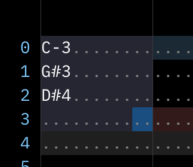

你经常会想要多个音符同时播放。回到最左边通道的最左列，这应该清除选中区域（？就是把之前的音符删掉）在不同通道的**第一列**输入不同音符。you'll usually want more than one note playing at a time. move back to the start of the pattern in the leftmost column of the leftmost channel; this should clear the selection area. put some different notes next to each other in the same row.现在只在不同通道的**第一列**输入音符。我们之后再去探索其他列。 （不要一次性输入六个以上音符，我们现在要留在有‘FM’标志的通道。）你输入好以后，回到顶端的行然后用`Enter`开始回放。这些音符应该作为一个和弦同时响起。only enter notes in the first column of each channel; we'll get to those other columns later. (don't do more than six notes at once yet. we want to stay in the channels labelled "FM" for now.) once those are in place, go back to the top row and use the `Enter` key to start playback. they should all sound at the same time as one single chord.

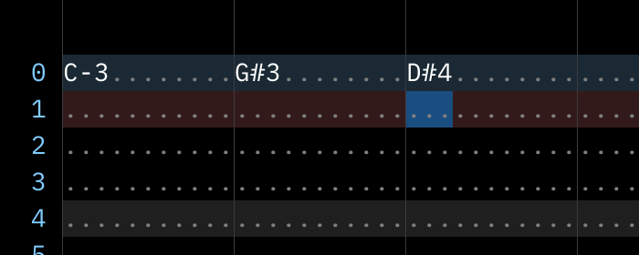

那个和弦会响很长时间，但是让我们试着让他早一些就停止。在那个和弦之后几行，在每个有音符的通道用`Tab`或`1`键输入一个**音符关Note Off**（有时也叫‘音符切断Note Cut‘）。它看起来应该是`OFF`。现在使用快捷键`F5`，能在不移到开头的情况下从开头播放。你应该会像之前一样听到那个和弦，然后它在Note Off处停止，就像抬起钢琴上按下的键一样。that chord will ring out for quite some time, but let's try stopping it early. a couple rows after that chord, use the `Tab` or `1` key to enter a **note off** (sometimes called "note cut") in each channel that has a note. it'll appear as `OFF` in the note column. now try the shortcut `F5` to play from the start without having to move there. you should hear the chord as before, then it will stop where the note offs are, as though letting off the keys of a piano.

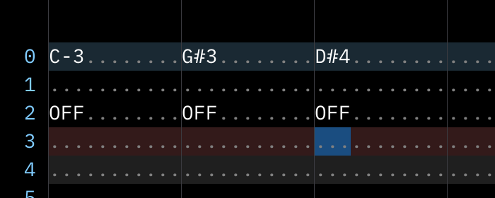

当然，也有可能犯错。假设那些Note Off是个馊主意，用`Ctrl-Z`可以撤销（undo）。Furnace记录着若干等级的撤销选项。撤销可以用于pattern视图，大部分的文本输入栏，以及一些其他地方。试一试，感受一下undo可以为你做什么！假设你觉得那些note off还不错，就按`Ctrl-Y`恢复撤销，把他们加回来。of course, errors can happen. let's pretend those note offs were a bad idea and undo them with `Ctrl-Z`. Furnace keeps track of multiple levels of undo. undo will work for the pattern view, most text entry boxes, and a few other places; try it out here and there along the way to get a sense for what it can undo for you! for now, let's change our minds again and put those note offs back with redo, which is `Ctrl-Y`.

在进入这个教程的下一部分之前，把整个模组module——包含整个乐曲所需要的一切的tracker文件——保存下来。使用`Ctrl-S`再在你的电脑选个好地方来存这个文件。Furnace的module总是使用`.fur`扩展名。before the next part of this guide, save the current **module** – the tracker file that contains everything needed for a song. use `Ctrl-S` and pick a good spot on your computer for the file. Furnace modules always have a filename that ends in a `.fur` extension.

## 怎么取得不同音色how do I get different sounds?

在界面顶端，中间稍微靠左的地方是**乐器**列表。也有波表和采样的选项卡，但是我们之后再看那里。就像真实的乐器，它们定义我们能在音乐里使用的声音。但是不像真实乐器的是，这些声音可以随便重新定义。at the top of the interface, just right of center, is the **instrument** list. there are also tabs for wavetables and samples, but we'll get to those later. just like physical instruments, these define the sounds we can use in the track. unlike physical instruments, these sounds can be endlessly redefined.

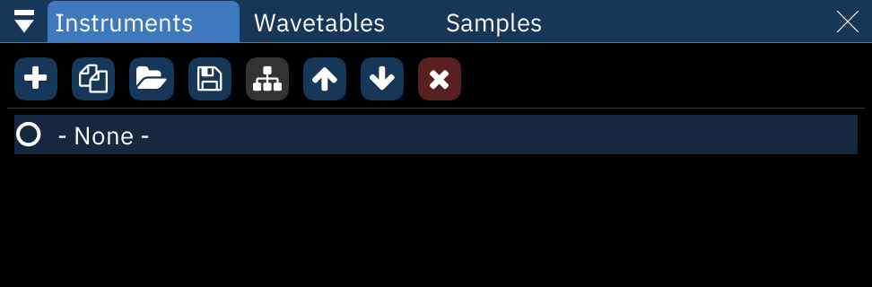

按`+`键来增加一个新乐器，会弹出一个乐器类型的列表，每个类型都对应所用的一种芯片所支持的类型。选择‘FM（OPN）’，新乐器会出现在列表里面，显示为‘00: Instrument 0’。这听起来与默认的乐器（显示为-None-）一样。click the `+` button to add a new instrument. a list of instrument types will pop up, one for each type supported by the chips in use. select "FM (OPN)", and the new instrument will appear in the list as "00: Instrument 0". this will sound the same as the default instrument (listed as "- None -").

我们需要一些不同的新东西，所以从别的module借来一个。打开第二个furnace实例（窗口），用`Ctrl-O`打开随furnace附带的`demos`目录里面的`quickstart.fur`。乐器列表应该包含"00: horn"；选中它，然后用上方软盘样子的保存乐器（save instrument）按钮保存到你喜欢的地方。furnace的乐器文件扩展名是`.fui`。we still need something new and different, so let's pull from another module. open up a second instance of Furnace and use `Ctrl-O` to open the `quickstart.fur` file included with Furnace in its `demos` directory. the instrument list will contain "00: horn"; select it, then use the floppy-disk save icon above it to save it wherever you like. Furnace instrument filenames end with the `.fui` extension.

我们来回到第一个实例（窗口），继续我们慢慢进展的练习乐曲，加载新乐器；点‘save instrument’右侧的文件夹状按钮并选中那个文件。它应该在列表显示为‘01: horn’并且已经高亮了。let's return to the first instance with our slowly-evolving practice track. load up the new instrument; click the folder button left of the "save instrument" button and select the file. it will appear in the list as "01: horn", and it should already be highlighted.

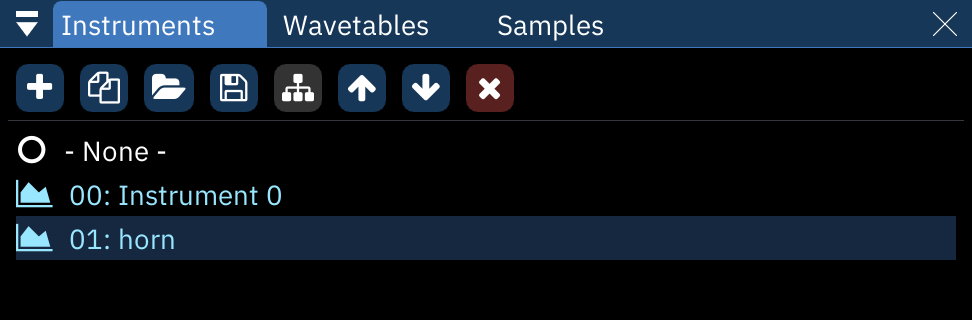

点击进到pattern视图，在另一个FM通道，我们已经有的和弦后面加几个音符。我们会听到以我们刚引入的新音色发出的音符，数字`01`显示在它们后面。这就是乐器列，它可以通过键入想要的数字来直接编辑。一般来说，每个音符都应该附带一个乐器值。click into the pattern view and add some notes in another FM channel well after our existing chord. we'll hear them with our new sound, and the number `01` appears next to them. this is the instrument column, and it can be edited directly by typing in the number desired. generally, each note should have an associated instrument value.

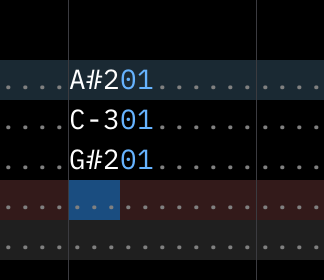

<!-- include this?
making new sounds for FM synthesis (the type of sound we've been using) is well beyond the scope of this guide, but when you've worked through this and are ready to try, YouTube user "funute" has assembled a fantastic ["crash course"](https://www.youtube.com/watch?v=cDJ1z-4YsYM) that will help. until then, let's move on.
-->

## 我怎么改变音量how do I change volume?

在乐器列右侧紧邻处就是音量列。在这里输入数值会改变对应的音符的响度。但是！它不总是像看起来那么直白而显然易见。next to the instrument column is the **volume** column. typing in it will change the loudness of the associated note... but it's not always as straightforward as it seems.

首先，这一列是以[十六进制hexadecimal](hex.md)计数的。其实乐器列也是如此，其它列也是一样。如果你不知道它的十进制等效表示，就把光标移到不懂的音量值处，再看菜单栏——同时也是状态栏。在那些菜单选项后面，它会显示“Set volume:”（设置音量）然后是十进制值，十六进制值，以及最大音量的百分比。for one thing, this column operates in [hexadecimal](hex.md). in fact, so does the instrument column, and so will the others when we get to them. if you're ever uncertain what the decimal equivalent is, put your cursor over the volume in question and look to the menu bar, which doubles as a status bar. after the menus, it will show "Set volume:", then the decimal value, hexadecimal value, and percentage of full volume.

并且，如果你还没有保存，末尾应该有一个“已修改的状态”标记（modified）。现在应该值得保存了。also, if you haven't saved your recent edits, there will be an indicator at the end which shows the "modified status". it might be worth saving now.

try typing `6C` into the volume column of the last note, then play it back. it should be much quieter than those before it in the column because they default to full volume  – in this case, `7F`. everything in the column after our `6C` will inherit that volume level until it's changed again, so you don't have to enter volumes for every single note.

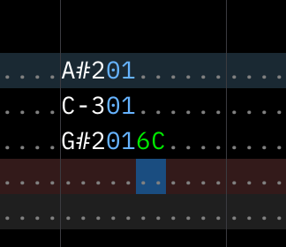

现在试着输入`90`，它会自动变成`7F`因为他是这个通道允许的最大音量值。由于不同芯片工作原理不同，各种通道允许的最大音量也不同。now try putting `90` in the volume column. it automatically changes to `7F` because that's the maximum volume available for this channel. different channels may have different maximum volumes because of how each chip works.

但是也有些奇怪的事。有的芯片使用‘线性’音量，与振幅成正比。把这个值减半就会让音量减半。其他芯片，就像我们现在正在使用的芯片，使用‘对数’式的音量。从音量的数值减去某个值就会*在现在的响度的基础上*降低音量。在我们现在的情况中，减去8得到`77`让音量降低一半，再减去8得到`6F`让音量变到四分之一。这可能不太容易习惯，但是有些时候这更方便。it gets a little stranger yet. some chips use "linear" volume, which translates directly to amplitude; dividing the value in half results in half the volume. other chips, such as the one we're using right now, use "logarithmic" volume; subtracting from it lowers the volume based on how loud it _sounds._ in this particular case, subtracting 8 to get `77` lowers the volume by half; subtracting 8 again to get `6F` lowers it to one-quarter. this takes some getting used to, but it's more convenient in some ways.

用**效果**改变音量的方法更多。清除我们的所有音符，在某个FM通道的顶端放置一个，把它设置到最大音量`7F`。在音量列之后就是效果列。效果列的第一列是效果类型列，它存放效果的类型。在那一列键入`0A`；这对应‘音量滑动’效果。右侧紧邻处，在效果数值列，输入`02`。点击`F5`从最开始播放，你会听到那个音符播放。但是没有保持音量不变，而是平稳淡出。there are more ways to change volume using **effects**. clear out all of our notes and place one at the top of one of the FM channels, and set it to full volume (`7F`). next to the volume column are the effect columns. the first of them is the effect type column, and it stores... the type of effect. in that column, type `0A`; this corresponds to the "volume slide" effect. next to that, in the effect value column, type `02`. hit the `F5` key to play from the start, and you'll hear the note play, but instead of staying at a steady volume it'll smoothly fade out.

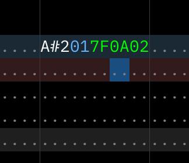

`0A`是个有趣的效果因为它的数值的两位数字是分裂的。从pattern视图右侧的‘效果列表effect list’找到`0Axy`，描述包含"(0y: down下降; x0: up上升)"。这意味着`01`是缓慢淡出，`0F`是最快淡出，`10`是缓慢淡入，`F0`是最快淡入。试一试，移到同一通道的10行然后输入效果`0A20`然后再播放一遍，音符会淡出，直到遇到新效果又会淡入回到最大音量！你也会注意到把光标放在效果上会在状态栏里面显示效果类型和描述。0A is an interesting effect because its two-digit value is split. look to the "effect list" to the right of the pattern view and find `0Axy`. the description includes "(0y: down; x0: up)". this means that while value `01` is a slow fade out and `0F` is the fastest, a value of `10` is a slow fade in and `F0` is the fastest. try it now; go to row 10 in the same channel and type an effect of `0A20`, then play again. the note will fade out until it hits that new effect, then fade back in to full volume! also note that putting the cursor on an effect will show the effect type and description in the status bar.

很重要的是要知道*大多数*效果是连续的，意味着它们会一直做它们所做的，直到被明确停止。音量滑动就像这样。你可以在16行输入效果`0A`，可以空着数值列或者在那里填`00`，它们都一样会停止效果。从开始播放，当音符重新淡入，它达不到最大音量就会停在那里。it's important to know that _most_ effects are continuous, meaning they will continue to do what they do until explicitly stopped. volume slides are like this. place an effect type of `0A` on row 16. you can leave the effect value blank or type `00` there; these are equivalent, and both will stop the effect. play from the start, and when the note fades back in, it'll stop short of full volume and remain there.

普通效果在[效果](../3-pattern/effects.md)文档更详细地介绍了。每个芯片都有它们独特的效果，这在[系统](../7-systems/)文档有介绍。然而，这部分还是之后再说吧。common effects are explained more thoroughly in the [effects](../3-pattern/effects.md) documentation. each chip may have its own specialized effects, which are covered in the [systems](../7-systems/) docs. however, those are best explored later.

在20行，添加一个没有音量的不同音符。从开始播放，你会听到新音符以旧音符停止时的音量播放。音量滑动的结果已经记录着通道的‘记忆’里面了。输入音量`7F`然后重新播放。新的音符会以最大音量开始然后衰减，因为`0A`指令还在发挥作用。on row 20, add a different note without a volume. play from the start, and you'll hear that the new note plays at the volume the previous one left off at. the result of the volume slide is kept in the "memory" of the channel. enter a volume of `7F` and play again; it will start at full volume, then ramp down because the `0A` volume slide is still going.

## 怎么让乐曲长一些how do I make the song longer?

现在我们的音乐还仅仅长6秒半。这是因为我们只有一个**order**。你看，‘pattern视图’这个词有些误导性，其实一个**pattern**只是一个通道的数据而已。pattern视图一下就显示一个order的所有pattern。这可能比较让人迷惑，因为有时候两个词都会用于我们所叫做order的东西，甚至有时在furnace内部也是如此！right now, our track is only about six and a half seconds long. this is because we only have one **order**. see, the term "pattern view" is slightly misleading in that a **pattern** is just one channel's worth of data; the pattern view shows all the patterns in an order at once. this can get confusing because sometimes both terms are both used to mean what we call an **order**, sometimes even within Furnace itself.

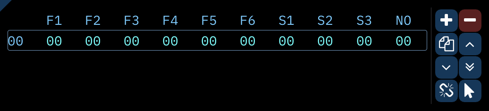

at the top left of the interface we find the order view. similar to the pattern view, it's like a spreadsheet, but even simpler. from left to right, the top line shows short names for all the channels. each row of numbers beneath that shows which patterns play in that order. for the moment, only the first order `00` appears. click on the `+` button to the right of the row of channel labels, and another order row appears, not only labeled `01` but filled with that same number. click in the pattern view and move to the top-left by hitting `Home` twice. you'll see that the new patterns are empty. the pattern view shows the end of the previous pattern but faded out. try moving between these by clicking on their order numbers in the order list.

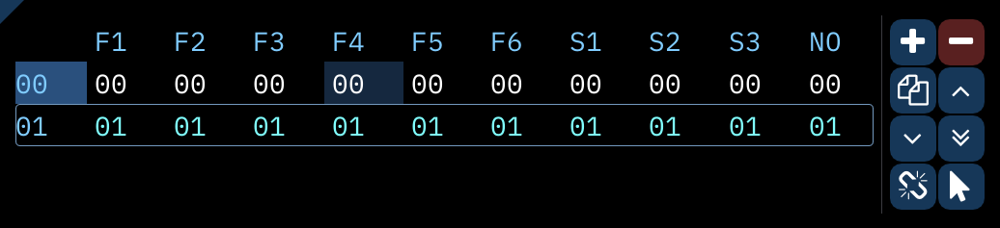

go to the first order and make sure there are some notes in the first channel. now click on the pattern number to the right of the order number (in the "F1" column); it will increase to `01`, and the notes we could see in the pattern view have disappeared! not to worry, they're still stored in the that channel's pattern `00`. select order `01` and right-click that first pattern number; it will decrease to `00`, and the notes in it will reappear. this way, you can rearrange and reuse parts of your track without having to duplicate them all the time.

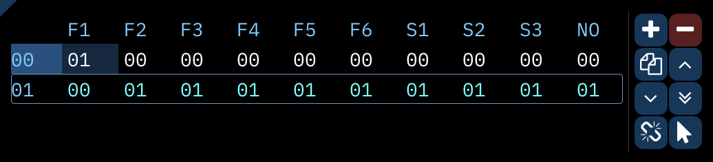

go back to the first order and put some notes in the first channel's pattern. in the order view, right-click the button showing two overlaid pages; this is the "duplicate" button. clicking it normally will add a row that repeats the current order. right-clicking that button creates a "deep clone", meaning that all the patterns in it are duplicated to new pattern numbers. when you want to make variations of the same patterns, this is somewhat faster than cut-and-paste (`Ctrl-X` and `Ctrl-V`, by the way, with `Ctrl-C` for copy).

重要的是pattern独立于order而存在。order列表是一个pattern的播放列表，可以自由重新排列。the important take away here is that patterns exist independently of orders. the order list is a playlist of patterns that can be freely rearranged.

## 我怎么改变拍速？how do I change tempo?

**拍速tempo**与**速度speed**有些不太好弄——事实上在furnace里面它们是不同的意思！首先让我们清空我们的第一个order，在里面均匀放一些音符。tempo and **speed** are a little tricky – in fact, for the purposes of Furnace, they mean different things! first, let's clear out our first order and put some evenly-spaced notes there.

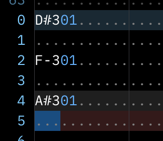

时间的最基本单位是**tick**。电子游戏系统几乎总是在视频的帧的基础上进行各种操作，它们一般每秒发生六十次，一般也叫60Hz（赫兹）。（这是对NTSC系统而言。使用PAL的系统会使用50Hz，街机游戏会用更多不同的值。）因为这个计时方法，回放期间的任何事都会在一个tick上面发生，不会在tick之间发生。the most basic unit of time is the **tick**. almost always, videogame systems take actions based on each frame of video, and these most often happen at 60 times per second, usually expressed as 60Hz. (this is for NTSC systems; systems that expect PAL will use 50Hz, and arcade games can use all sorts of different values...) because of this timing, everything that happens during playback will happen on a tick, never in between ticks.

如果我们点击顶端右侧的‘速度Speed’选项卡，我们会看到最上面‘基础拍速Base Tempo’右侧显示tick速率是‘60Hz’。我们可以把base tempo改到任意的一个值，tick速率会随之改变，但是这对于系统的性能来说就不真实了。所以把base tempo改回150。我们看到在三行下面‘分频器Divider’输入框的右侧有计算出的拍速，是‘150.00BPM’if we click on the "Speed" tab at the top-right of the interface, we'll see the "Base Tempo" line at the top shows the tick rate as "60Hz" to the right. we could change the base tempo to something arbitrary and the tick rate would change accordingly, but this wouldn't be authentic to the system's capabilities, so let's leave the base tempo at 150. we see the calculated tempo three lines down, to the right of the input for "Divider"; it reads "150.00 BPM".

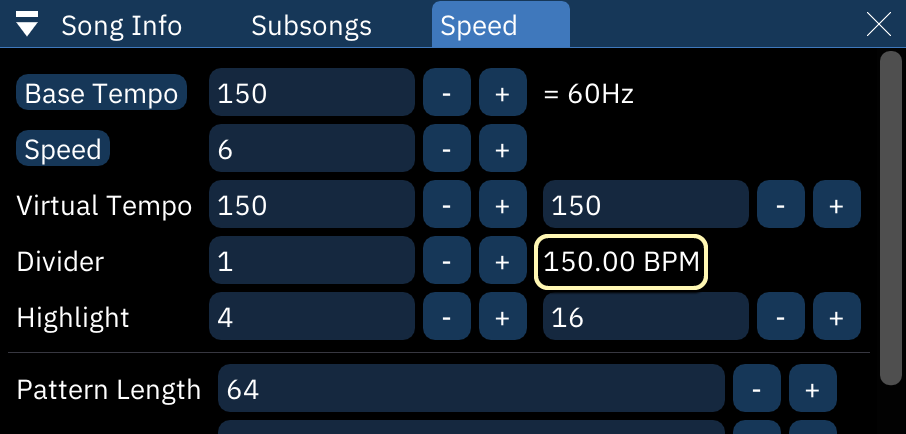

在base tempo的下面是‘速度’，设置为6.现在每一行都长6tick，6tick后就转到下一行。先播放一下我们的音符，感受一下它们的拍速。然后把速度改为5，Divider后面的拍速会显示为‘180.00 BPM’。播放一下，我们的音符当然更加快了——或许有些快过头了。可以通过不断变化的速度来取得中间的拍速。感兴趣的话，之后看一看[速度speed与律动groove](../8-advanced/grooves.md)。beneath Base Tempo is "Speed", set to 6. right now, each row takes 6 ticks to complete before moving to the next row. let's say we want things to be a little faster. play the current set of notes to hear their tempo first. then, change speed to 5; the tempo after "Divider" will now show "180.00 BPM". play our notes back, and they're definitely faster... perhaps faster than desired. it's possible to get tempos in between by alternating speeds; if you're interested, check out the documentation on [speeds and grooves](../8-advanced/grooves.md) later on.

## 其他的通道呢？what about those other channels?

我们会进入这个模拟的游戏机平台的关键部分。我们一直在使用Furnace的默认系统，世嘉Genesis。它使用两个不同的芯片。第一个是雅马哈YM2612，也叫雅马哈OPN2；它使用频率调制（FM）合成来产生声音。另一个是世嘉PSG（其实型号是SN76489）；它是可编程声音发生器（PSG），只能产生50%占空比方波和各种噪音。这太不灵活了，但是也别无视它——毕竟它是经典的世嘉Genesis音乐的一部分。here's where we really get into the nitty-gritty of our emulated videogame system. we've been using Furnace's default system, the Sega Genesis. it employs two very different sound chips. the first is the Yamaha YM2612, also known as the Yamaha OPN2; it uses frequency modulation (FM) synthesis to generate sounds, and that's what we've heard so far. the other sound chip is the Sega PSG; it's a programmable sound generator (PSG) that can only make square waves and variations of noise. it's nowhere near as versatile, but don't ignore it – it's an important part of the classic Genesis sound.

我们从创建一个新乐器开始。这时从列表选择‘SN76489/Sega PSG’。新的‘乐器Instrument 2’出现在乐器列表中并已被选中。现在点击切到pattern视图并且把已有的一个音符的乐器换成新的乐器。乐器会从淡蓝色变成亮黄色；这意味着新的乐器不适合它所被使用的芯片。如果我们播放它，只能听到那个熟悉的默认FM乐器。let's start by creating a new instrument, this time choosing "SN76489/Sega PSG" from the list. the new "Instrument 2" appears in the instrument list, already selected. now click in the pattern view and change one of our existing notes to use the new instrument. the number will change color from soft blue to bright yellow; this means that the chosen instrument isn't meant for the chip it's being used on, and if played back, we'll only hear that familiar default FM instrument.

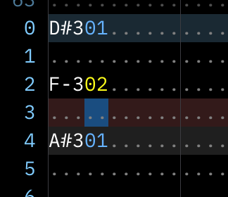

继续，撤销刚才的编辑，然后转到有‘方波Square 1’标头的通道，它是PSG的第一个通道。试着用新乐器添加音符，它们就会正常工作了。当然，它们是朴实无华的方波。趁着我们还在这里，试着通过键入新音量来让它们安静一些。因为这芯片只使用16级音量，`0F`就是最大音量了。go ahead and undo that edit, then move to the channel labelled "Square 1", the first of the PSG's channels. try adding notes with the new instrument, and they'll work just fine without complaint. of course, they're plain, no-frills square waves. while we're here, try making them quieter by entering new volumes; since this chip only uses sixteen volume levels, `0F` is the maximum.

现在移动到噪音通道。同一个乐器在那里也能用，但是播放不同音符得到的是不同‘音调’的噪声。这个通道比它看起来的样子既更灵活又更不灵活，还有一些可见的怪异之处，我们现在不会讨论，但是之后看一看[这个芯片的文档](../7-systems/sms.md)吧。let's move to the noise channel now. the same instrument will work here, but playing different notes gets us different "pitches" of noise. this channel is both more and less versatile than it seems, with several notable quirks that we won't get into here, but take a look at [this chip's documentation](../7-systems/sms.md) later on.

## 采样呢？ what about samples?

世嘉Genesis的FM部分有一个特殊特性；通道6可以用于播放数字**采样**。这意味着任何录音——一个小军鼓，一个orchestra hit，某人说话声，你有的随便什么东西——都可以成为音乐的一部分。the FM side of the Sega Genesis has a special feature; channel 6 can be used to play back digital **samples**. this means that any recording – a snare drum, an orchestra hit, somebody talking, whatever you have – can be part of the music.

回到Furnace的第二个实例（窗口）。就像我们上次保存乐器一样，切换回‘采样samples’选项卡，选择那里的唯一采样‘0: example’，然后把他保存为`.wav`文件。切换回到我们编曲主要使用的那个furnace实例，在Sample选项卡打开它。go back to that second instance of Furnace. just as we saved an instrument last time, let's switch to the "Samples" tab and select the lone sample there, "0: example", then save it as a `.wav` file. swap back to the instance of Furnace we've been working in, and in the Sample tab, open it.

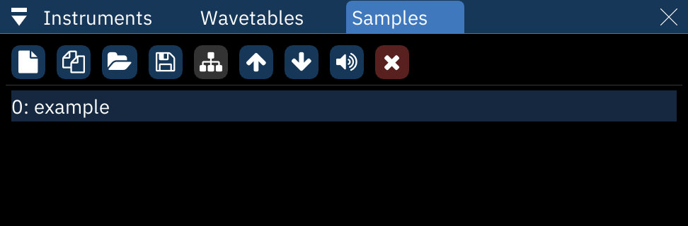

为了使用这个采样，我们想创建一个引用它的乐器。右键列表中的采样然后点击‘创造乐器make instrument’。‘Instrument Editor’窗口会弹出提醒我们我们现在有一个叫做‘example’的乐器3，它的类型是‘通用采样generic sample’，在他下方，选中的采样是‘example’。趁着我们还在里面，让我们把乐器名字改为‘bell’因为它听起来就像bell（钟）。只要选中顶端的‘example’然后在那上面打字。in order to use the sample, we want to make an instrument that references it. right-click on it in the list and select "make instrument". the "Instrument Editor" window will pop up to show us that we now have an instrument 3 named "example", a type of "Generic Sample", and below that, the sample selected is "example". while we're at it, let's change the instrument name to "bell" since that's what it sounds like; just select the "example" at the top and type over it.

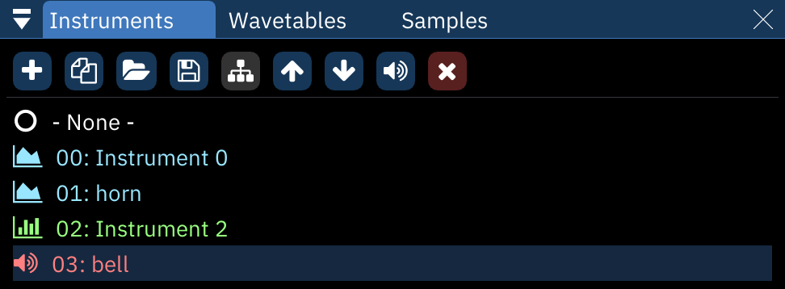

现在让我们听听它实际用起来怎么样。关闭乐器编辑器，清空我们的第一个order的pattern里面的所有东西。（要么删除那里的所有东西，要么调整order让那个pattern一边儿去。试着连续按三次`Ctrl-A`选中所有东西。）切换到我们的新的bell乐器，在FM 6通道放置一个C-4音符。我们回放它的时候，听起来真不错！now, let's hear it in action. close the instrument editor, then clear out everything in the patterns of our first order. (either delete what's there, or adjust orders to get it out of the way. try hitting `Ctrl-A` three times to select everything at once.) switch to our new bell instrument and put a C-4 note in channel "FM 6". when we play it back, it sounds perfect!

if ever a sample sounds out of tune, refer to the [sample tuning guide](../9-guides/tuning-samples.md) to fix it up.

重要的是：这时我们可以使用通用采样这一乐器类型，但是有的芯片用独特的方式使用采样。总要记着查阅[芯片的文档](../7-systems/)，了解在它身上使用采样的最好方法。an important note: in this case, we can use a Generic Sample instrument type just fine, but there are chips that use samples in specialized ways. always check [the chip's documentation](../7-systems/) for the best way to use samples with it.

现在我们已经从`quickstart.fur`获得了所需的所有东西，关闭那个Furnace的实例吧。now that we've gotten everything we need from `quickstart.fur`, close that instance of Furnace.

## 波表呢？what about wavetables?

有的芯片能使用**波表wavetable**，就像非常短的循环的采样。这些芯片其一是Game Boy（任天堂的古董掌机）。我们创建一个新文件，要么用菜单，要么用`Ctrl-N`。一个警告对话框问你要不要保存之前的文件，这由你。之后一个对话框弹出来问我们想要什么系统。在搜索框输入‘boy’，它应该在结果的顶端，选择它。some chips can use **wavetables**, which are a lot like very short looping samples. one of these is the Game Boy. let's start a new file, either from the menu or with `Ctrl-N`. a warning dialog asks if you want to save; it's up to you. after that, a dialog box pops up to ask which system we want; type "boy" in the search and it will be at the top of the results. select it.

在我们的全新乐曲里面，我们想加入一个新波表。在‘Instruments乐器’与‘Samples采样’选项卡之间，选择‘Wavetables波表’。用`+`按钮添加一个新波表。Furnace会生成一个对现有芯片正大小合适的波表，里面已经有一个锯齿波了。in our brand new song, we'll want to add a new wavetable. between the "Instruments" and "Samples" tabs, select "Wavetables". add a new one with the `+` button. Furnace will generate a wavetable of the right size for the current chip, and it will already have a sawtooth wave in it.

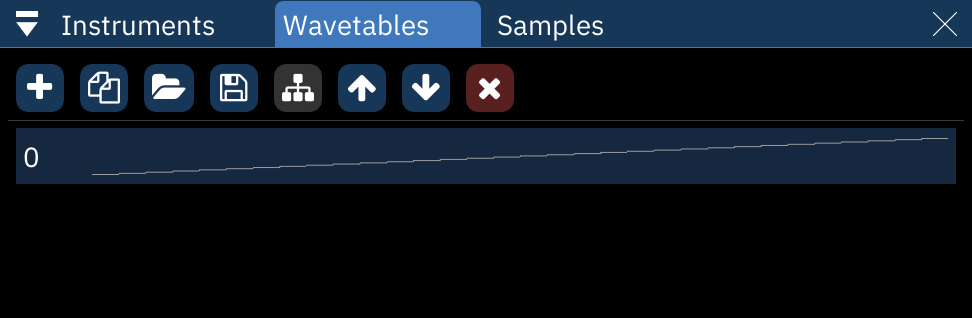

双击新的选项打开‘波表编辑器Wavetable Editor’。你会看到一条由像素状的方格组成的线。这就是我们的锯齿波了。虽然这些很好，我们还是发挥一下创意。点击这里面里面的任意地方并且‘绘制’一条新波形，一条有趣的新波形。注意在窗口底下有一列数字随着你的编辑而变化。你可以通过直接编辑那些数字来改变上方的波形。先记住它，一会要用。等到你对这条波形满意了，至少再画两条用于之后的演示。double-click that new entry to open the "Wavetable Editor". you'll see a line of large pixel-like blocks. this is our sawtooth wave. nice as those are, let's get creative. click anywhere in that area and "draw" a new wave, something interesting. note that at the bottom of the window, there's a line of numbers that change as you edit. you can edit the numbers directly to change the values above; keep this in mind for later. once you're happy with this wavetable, make at least two more, just for later demonstration purposes.

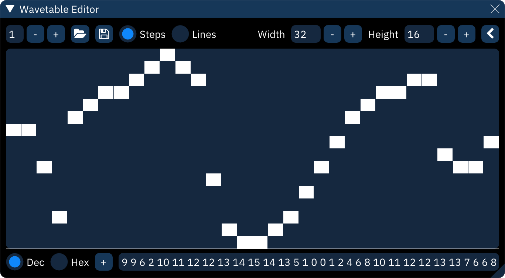

现在，我们暂时还不能对这条波形做些什么。就像采样，他需要一个乐器。这时我们不能从波表直接创建一个乐器，所以转到乐器列表然后添加一个新的。在乐器编辑器instrument editor打开它，用你喜欢的名字命名它，然后选择它的‘宏macros’选项卡。right now, we can't do much with this wavetable; as with samples, it needs an instrument. this time we can't just create one directly from the wavetable, so go to the instruments list and add a new one. open it up in the instrument editor, name it whatever you like, then select its "Macros" tab.

我们之后再更详细地谈论宏macros，但是现在，只要点击‘Waveform波表’旁边的下箭头，再点击刚出现的`+`键。右面的框里面有一列变灰了。在那一列的中间点一下，它的一半会变成橘色；这就是你为乐器选择要使用哪一个波表的方法，就像一个条形图一样。we'll get to macros in more detail in a bit, but for now, simply click the down-arrow next to "Waveform". click the `+` button that appears; a column will turn grey in the box to the right. click in the middle of that column and it turns half orange; this is how you select which wavetable to use for this instrument. it's like a bar graph.

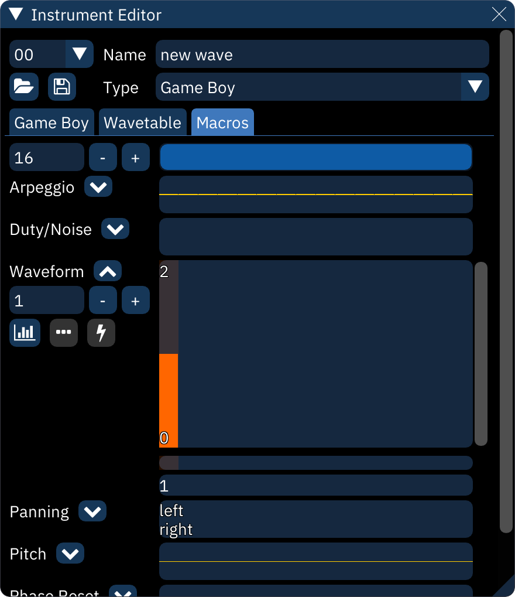

关掉波表编辑器，把乐器编辑器移动到一边去，然后点击pattern视图里面的‘wavetable’通道。添加几个音符来感受一下它们的音色。在乐器编辑器instrument editor里面把宏改成一个不同的值，再播放一遍那些音符来听听你做的那些波表的不同。close the wavetable editor, move the instrument editor off to the side, and click into the "Wavetable" channel in the pattern view. add a few notes to get a good sense of their tone. in the instrument editor, change that macro to a different value, and play the notes again to hear the difference between the wavetables you made.

## 但是。。啥是宏（macro）but... what's a macro?

**宏macro**大概是Furnace最nb的特性了。正式的定义是，它自动操作一个音符播放时的各种参数。很多能用效果effects做成的可以用宏macro做成，但是它不是以行计时，而是以tick计时。the **macro** is perhaps Furnace's most powerful feature. formally defined, it automates a note's parameters while it plays. a lot of what can be achieved with effects can be done with macros, but on a per-tick basis instead of per-row.

我们开始先把已经输入的音符删除掉。之后，把光标移动到顶上最左侧的‘pulse （方波）1’通道。创建一个新乐器，进入乐器编辑器。我们想操作一下音量宏，但是在此之前，我们先得选择‘Game Boy’选项卡并且选择标有‘use software envelope（使用软件包络）’的复选框。Game Boy的音源硬件可以自己产生有限的音量包络，但是我们现在用不着。如果我们不选那个复选框，音量宏就没效果（尽管其他的宏还能用）。1let's start by clearing out the notes we've entered. after that, move the cursor to the top-left into the "Pulse 1" channel. create a new instrument and go into the instrument editor. we'll want to work with the volume macro, but before we can do that, we have to select the "Game Boy" tab and check the box labelled "Use software envelope". the Game Boy's sound hardware can do its own limited volume envelopes, but those won't help us right now, and if we leave the box unchecked, the volume macro won't work (though the others will).

在‘宏’栏，‘Volume（音量）’字样下面的数字输入区域就是音量宏的长度。我们把它设置到30.在右侧的大框里面，从最接近最小的音量1向右到最大的音量15画一个斜坡，再向右从上到下画一个。如果那不太平坦也不碍事。你总可以从大框下面的数字输入栏直接编辑，就像波表编辑器里面那样。也可以试着右键宏然后拖拽，这回你应该得到平滑的斜坡了。in the "Macros" tab, the number input field that appears beneath the word "Volume" is the length of the volume macro; let's set it to 30. in the large box next to it, draw a ramp from near minimum volume (1) to maximum volume (15) at the left, then another down to minimum volume (0) at the right. if it's a little uneven, that's okay; you can always edit the numbers directly beneath the box, just as with the wavetable editor. also try right-clicking in the macro and dragging; now you have perfectly smooth ramps.

你可能不能一下子看到宏的全貌。使用宏选项卡顶端的滑动条，可以左右移动。更好的方法是用左侧的`-`键把那些柱状图变窄一些，以便你能看到全貌！you may have a little trouble navigating the whole macro at once. use the scrollbar at the top of the macros tab to move around it. even better, use the `-` button to the left of it to narrow the bars until it's all visible!

在乐器编辑器里面（只要你没在文本框区域），你可以用键盘演奏音符，却不影响pattern视图里面的任何东西。试一试，你会发现按下按键后音符快速淡入（约等于起音Attack）再淡出（约等于衰减Decay）。当然你可以用效果实现这一点，但是如果你要在很多音符都使用这个效果，让乐器自己做到这效果可以节省太多码字的功夫了！while in the instrument editor (and as long as you're not in a text box) you can play notes on the keyboard without affecting anything in the pattern view. give it a try, and you'll notice that when held down, each note does its own quick fade in then fade to silence. you could do this with effects, but if you're using it on many notes, doing it with the instrument itself could save a lot of typing!

在pattern视图增加几个间距足够大的音符，让音量上升和下降都能听到。（在速度=6时，5行就能做到。）然后看看宏视图macro view下面的瘦条状框。他看起来可能不显眼，但是如果你按住`Shift`然后在宏的峰值的正下方点一下，就会亮起绿色。我们刚刚设置了一个**音符释放点**。再试着演奏一下，注意到按下按键不放会使得音符停在最高音量处——也就是在音符释放点处——直到松开按键。现在从头开始播放你的乐曲，每个音符都会上升到最大音量保持不动，一直到下一个音符播放。in the pattern view, add a few notes spaced far enough apart that the whole rise and fall is audible (at speed 6, five rows will do). then look to the thin bar underneath the macro view. it may not look like much, but if you hold the `Shift` key and click directly underneath the peak of the macro, it will light up green. we've just set a **release point**. play with the instrument a little here, and notice that holding the key down holds the note in place at top volume – at the release point – until let go. now play the song from the start; each note will rise to max volume then stay there until the next note plays.

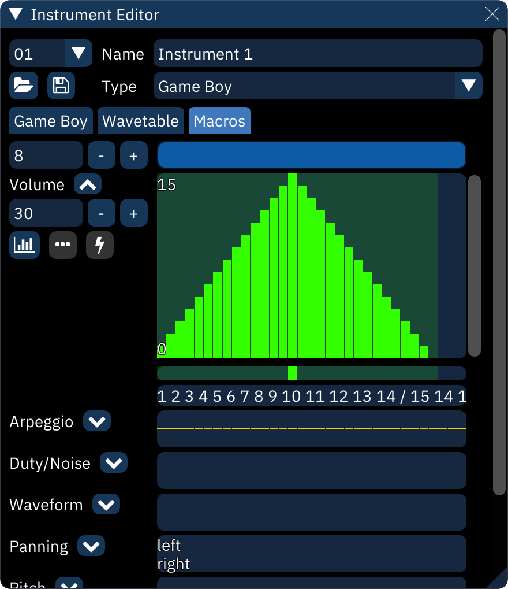

在大概我们的乐曲的最后一个音符后面大概十行处放置一个音符关。我们的音符上升到最高处，然后突然截断了！想让宏的剩下部分播放，就把光标移动到音符关上面，用`~`键放置一个**宏释放macro release**作为替代，它会显示成`REL`现在乐曲回放的时候，最后一个音符会上升并保持稳定直到它遇到宏释放，然后我们会听到宏的剩余部分播放出来。about ten rows after the last note in our song, place a note off. the final note rises to maximum, then is suddenly cut off! to get the rest of the macro to play, move your cursor over the note off and use the `~` key to replace it with a **macro release** instead, which will appear as `REL`. now when the song is played back, the final note will rise and hold steady until it reaches the macro release, then we'll hear the rest of the macro play out.

宏是nb的工具。读一读[宏的文档](../4-instrument/README.md)，利用好它们！macros are absurdly powerful tools. read the [macro documentation](../4-instrument/README.md) to make the most of them!

## 下面呢？what's next?

现在你知道用Furnace做音乐的基本操作了。从此，你应该更理解文档的剩下内容了，这些应该是你的首要参考资料。如果你有在这里找不到答案的问题，就去Furnace的Github目录的[Discussions section](https://github.com/tildearrow/furnace/discussions)去问问问题吧！now you know the basics of how to make music with Furnace. from here, the rest of the documentation should make more sense, and it should be your primary reference. if you have questions that aren't answered there, feel free to ask in the [Discussions section](https://github.com/tildearrow/furnace/discussions) on Furnace's GitHub repository.

总之，不要害怕实验。生命不息，折腾不止！most of all, don't be afraid to experiment. go play!
