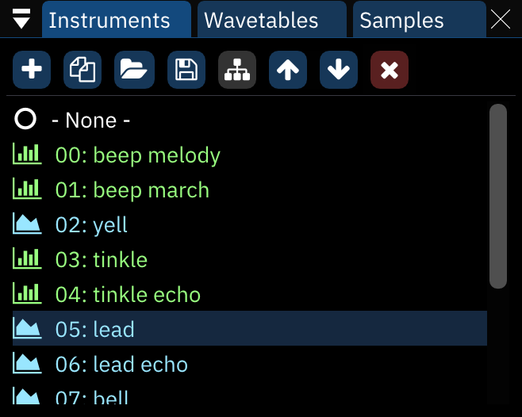
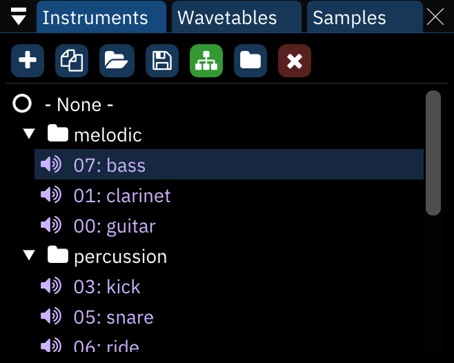
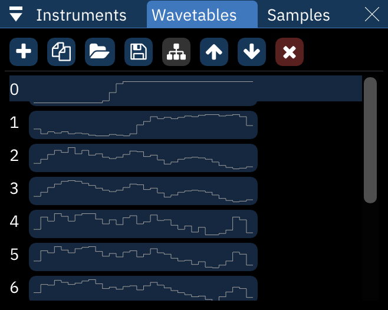
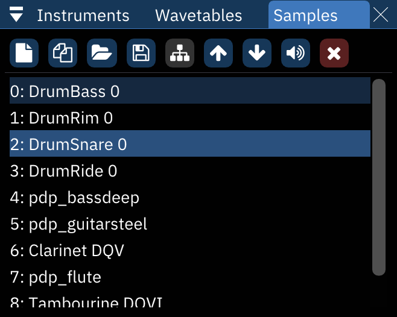

# asset列表asset list
*(asset是'资产,有用的人/物'意思,这里大概是'构成音色的组件'的意思)*
一个asset指的是一个乐器(预设),波表或者采样.an "asset" refers to an instrument, wavetable or sample.

## 乐器列表instrument list

从左到右的各个按钮buttons from left to right:

- **添加Add**: 弹出一个菜单,能够选择要添加哪种乐器.如果只有一种可用的乐器类型,就不会弹出菜单.pops up a menu to select which type of instrument to add. if only one instrument type is available, the menu is skipped.
  - 如果"添加乐器时候显示乐器类型列表"选项被禁用,就跳过这个菜单,按照光标下的通道的乐器类型添加一个新乐器.if the "Display instrument type menu when adding instrument" setting is disabled, this skips the menu and creates an instrument according to the chip under the cursor.
  - 右键总是打开这个菜单right-clicking always brings up the menu.
- **复制Duplicate**: 生成一份当前所选乐器的副本duplicates the currently selected instrument.
- **打开Open**: 打开一个选择乐器文件的对话框,选择的文件会被加载为列表末尾的一个新乐器brings up a file dialog to load a file as a new instrument at the end of the list.
  - 如果文件是个乐器库,一个对话框会弹出来让你选择要添加哪些乐器if the file is an instrument bank, a dialog will appear to select which instruments to load.
- **保存Save**: 打开一个文件对话框,让你保存当前所选的乐器.brings up a file dialog to save the currently selected instrument.
  - 乐器被保存为furnace乐器(.fui)文件.instruments are saved as Furnace instrument (.fui) files.
  - 右键打开一个具有以下的选项的菜单:right-clicking brings up a menu with the following options:
    - **保存为.dmp... save instrument as .dmp...**: 将乐器保存为deflemask格式saves the selected instrument in DefleMask format.
    - **保存所有乐器save all instruments...**: 将所有乐器以.fui格式保存到选择的文件夹saves all instruments to the selected folder as .fui files.
- **切换文件夹/标准视图Toggle folders/standard view**: enables (and disables) folder view, explained below.
- **上移Move up**: 将所选的乐器在列表上上移一位.pattern里面的乐器数据会自动跟随切换.moves the currently selected instrument up in the list. pattern data will automatically be adjusted to match.
- **下移Move down**: 类似上面same, but downward.
- **删除Delete**: 删除现在所选的乐器,pattern的乐器数据会调整为使用列表中的下一个可用的乐器.deletes the currently selected instrument. pattern data will be adjusted to use the next available instrument in the list.

乐器可以拖动--释放以改变顺序.这会相应的改变module中其他地方的instruments may be dragged and dropped to reorder them. this will change instrument numbers throughout the module accordingly.

## 文件夹视图folder view

在文件夹视图中,"上移""下移"选项就会消失,出现一个新的选项:in folder view, the "Move up" and "Move down buttons disappear and a new one appears:
- **新建文件夹New folder**: 字面意思creates a new folder.

asset可以从一个文件夹拖到另一个文件夹,甚至在文件夹中更改顺序,不影响他们关联的的数字.assets may be dragged from folder to folder and even rearranged within folders without changing their associated numbers.

右键文件夹可以改名或者删除它.删除一个文件夹并不会删除里面的乐器.right-clicking on a folder allows one to rename or delete it. deleting a folder does not remove the instruments in it.

## 波表列表wavetable list

乐器列表里面的所有东西同样也适用于这里,但是有一个大的不同:向上向下移动波形,改变他们的顺序,**并不会**相应的改变pattern或者乐器中的数据. 一定要小心!.everything from the instrument list applies here also, with one major difference: moving waves around with the buttons or dragging them will change their associated numbers in the list but **not** in pattern or instrument data. be careful!

波表储存为furnace波表(.fui)文件wavetables are saved as Furnace wavetable (.fuw) files. 

右键单击保存按钮会弹出一个有以下选项的菜单:right-clicking the Save button brings up a menu with the following options:
- **把波表保存为.dmw...save wavetable as .dmw...**: 把选中的波表保存为deflemask格式.saves the selected wavetable in DefleMask format.
- **保存原始波表save raw wavetable...**: 把选中的波表保存为原始数据saves the selected wavetable as raw data.
- **保存所有波表save all wavetables...**: 把选中的文件夹里面的所有波表保存为.fuw文件saves all wavetables to the selected folder as .fuw files.

## 采样列表sample list

波表中的所有内容都适用于这里,但是在删除按钮之前加上了一个按钮everything from the wavetables list applies here also, with the addition of one button before the Delete button:
- **预览Preview**: 以默认音高播放默认的采样plays the selected sample at its default note.
  - 右键停止播放采样right-clicking stops the sample playback.

采样保存为标准的.wav文件.samples are saved as standard wave (.wav) files.

右键单击保存按钮出现一个菜单,具有以下选项:right-clicking the Save button brings up a menu with the following options:
- **保存原始采样save raw sample...**:把选中的采样保存为原始数据 saves the selected sample as raw data.
- **保存所有采样save all samples...**: saves all samples to the selected folder as .wav files.

右键单击列表中的一个采样就会弹出一个菜单right-clicking a sample in the list brings up a menu:
- **制作乐器make instrument**: 创建一个新的乐器,使用选中的采样.creates a new instrument which is set to use the selected sample.
- **让我成为一个鼓组make me a drum kit**: 让你能够使用列表中的所有采样制作一个鼓组.详细请见下一节.allows you to instantly create a drum kit using all the samples in the list. see the next section for more information.
- **复制duplicate**: 制作选中的采样的一个副本makes a copy of the selected sample.
- **替换replace...**: 打开一个文件对话框,选择一个替换的采样opens a file dialog to choose a replacement sample.
- **保存save**: 打开一个文件对话框,选择在哪里保存采样opens a file dialog to choose where to save the sample.
- **删除delete**: 删除采样removes the sample.

### 让我成为一个鼓组make me a drum kit

为了更方便地创造一个鼓组,我增加了这个选项.I have added this option to make it easier for you to create a drum kit.
它把所有采样放到一个文件里面,它带有一个采样映射表.it puts all the samples into a new instrument with sample map.

选择这些选项之后,会出现一些参数.after selecting this option, a list of parameters appears:

- **鼓组模式Drum kit mode**: select how to arrange the samples in the sample map.
  - **正常Normal**: 把所有的采样从第一个的八度开始依次排列put all samples from the starting octave onwards.
  - **每个八度12个采样12 samples per octave**: 把最前面的12个采样映射到所有八度,就像Deflemask一样.map the first 12 samples to all octaves, DefleMask-style.
- **开始的八度Starting octave**: 改变最开始的采样应该所处的八度change the octave where the first sample will be at.

跟随着是一个可用的乐器类型的列表.点击他们中的一个,继续创造鼓组吧!following that is a list of viable instrument types. click on one of them to proceed with drum kit creation!
