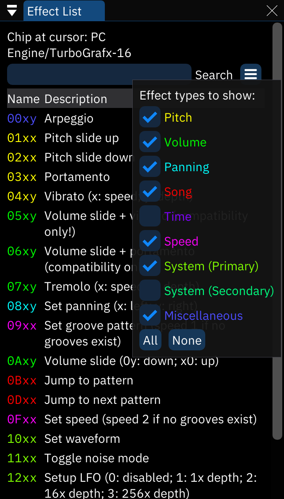

# 效果列表窗口effect list window

这个窗口提供了可用的效果的列表this window provides a list of the effects that are available.

更多有关效果的信息请见for more details about these effects, see [the effects page](../3-pattern/effects.md).

- **光标处芯片Chip at cursor**: 目前选中的芯片.这个列表只展示这个芯片上可用的效果.the currently selected chip. the list only shows available effects for this chip.
- 菜单按钮menu button: 打开一个小的效果分类列表.可以分别切换某个分类中的效果是否显示出来opens a small list of effect categories. toggle each to change whether effects belonging to such categories will be shown in the list.
