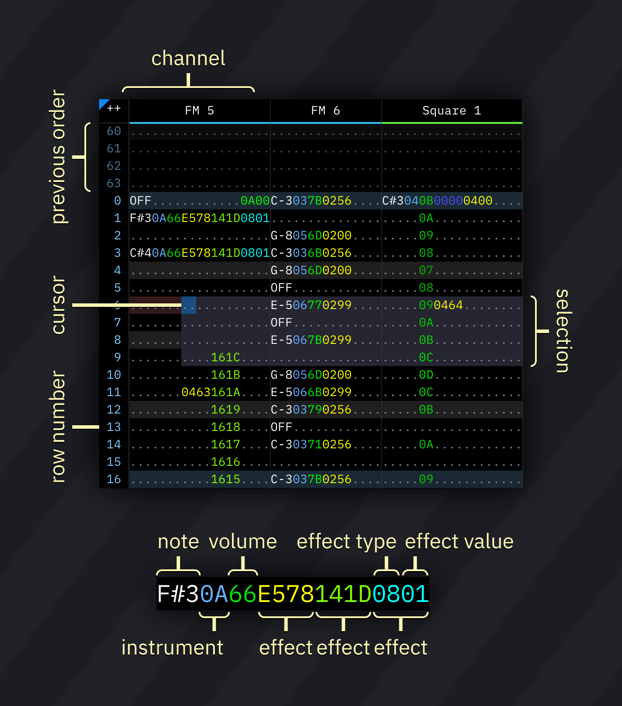
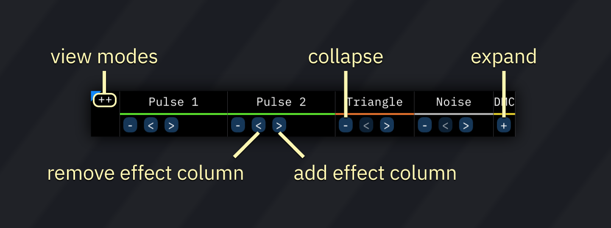
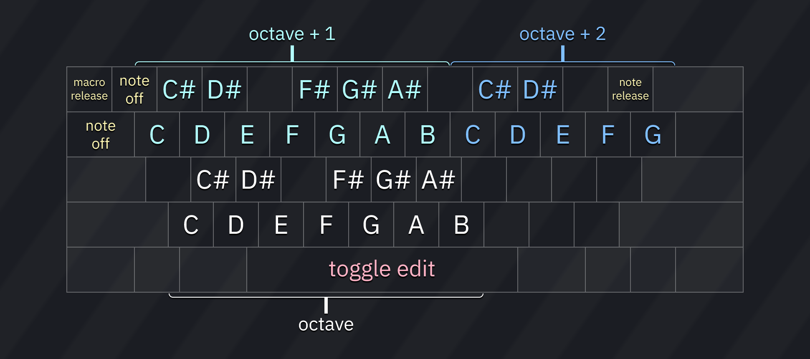

# pattern

pattern视图让你编辑歌曲的pattern。the pattern view allows you to edit the song's patterns.

一个pattern包括许多列('通道')和带有行号的行.a pattern consists of columns ("channels") and numbered rows.
每个列都有如下排列的几个子列each column has several subcolumns in this order:

1. 音符note
2. 乐器instrument
3. 音量volume
4. 效果,分为效果类型和效果值.effects, split into effect type and effect value

所有列都用十六进制表示,除了音符列.all columns are represented in hexadecimal, except for the note column.

行的高亮显示拍与小节.row highlights show beats and measures, and are configured in the [the Speed window](../2-interface/song-info.md).

## 光标与选择cursor and selection

你可以通过点击pattern上面的任何位置来改变光标位置you may change the cursor position by clicking anywhere on the pattern.

要想选中区域,就长按鼠标左键不动,然后拖动鼠标到结束的地方再放开左键,完成选择.to select an area, press and hold the left mouse button. then drag the mouse and release the button to finish selection.

在pattern视图里面右键会弹出一个菜单,里面有[edit menu](../2-interface/menu-bar.md)里面的大部分选项.right-clicking within the pattern view brings up a pop-up menu with most options from the [edit menu](../2-interface/menu-bar.md).

## 通道 条channel bar

使用通道条,你可以调整通道显示的几个方面using the channel bar, you may adjust several aspects of the channel display.

点击通道名称就会静音这个通道. clicking on a channel name mutes that channel.

双击或者右键就会启用独奏模式, 这时只有这个通道有声音.double-clicking or right-clicking it enables solo mode, in which only that channel will be audible.

点击左上的 `++`就会弹出一个小菜单有以下项目: clicking the `++` at the top left corner of the pattern view pops up a small menu to set view modes:
- **Effect columns/collapse**: displays extra options for collapsing channels and adding/removing effect columns:
  - **-**: collapse visible columns. changes to **+** when columns are hidden; click to expand them.
  - **<**: disables the last effect column and hides it. effects are not deleted...
  - **>**: adds an effect column. if one previously existed, its contents will be preserved.
- **Pattern names**: displays pattern names (per channel). pattern names are also visible when hovering over a pattern in the order list.
- **Channel group hints**: display indicators when channels are paired in some way (e.g. OPL3 4-op mode).
- **Visualizer**: during playback, show visual effects in the pattern view.
  - also can be toggled by right-clicking on the `++` button.
- **Channel status**: displays icons that indicate activity in the channel. see the "channel status" section below.

to rename and/or hide channels, open [the Channels window](../8-advanced/channels.md) via the window menu.

### channel status

- note status:
  -  note off
  -  note on
  -  note on but macro released (`REL`)
  -  note released (`===`)
- pitch alteration:
  -  nothing
  -  pitch slide up
  -  pitch slide down
  -  portamento
  -  arpeggio
- volume alteration:
  -  nothing
  -  volume slide up
  -  volume slide down
  -  tremolo
- other icons may be present depending on the used chips.

## input

### note input

- pressing any of the respective keys will insert a note at the cursor's location, then advance to the next row (or otherwise according to the Edit Step.)
- **note off** (`OFF`) turns off the last played note in that channel (key off for FM/hardware envelope; note cut otherwise).
- **note release** (`===`) triggers macro release (and in FM/hardware envelope channels it also triggers key off).
- **macro release** (`REL`) does the same as above, but does not trigger key off in FM/hardware envelope channels.
- **toggle edit** enables and disables editing. when editing is enabled, the cursor's row will be shaded red.

### instrument/volume input

type any hexadecimal number (0-9 and A-F). the cursor will move by the Edit Step when a suitable value is entered.

### effect input

works like the instrument/volume input.

each effect column has two subcolumns: effect and effect value.
if the effect value is not present, it is treated as `00`.

most effects run until canceled using an effect of the same type with effect value `00`, with some exceptions.

here's [a list of effect types](effects.md).

## 快捷键keyboard shortcuts

这些是默认的键盘快捷键.所有快捷键都在设置窗口里面可以设置.these are the default key functions. all keys are configurable in the Keyboard tab of the Settings window.

key         | action
------------|-----------------------------------------------------------------
Up/Down     | 向上/向下移动一行或者一个Edit Step.move cursor up/down by one row or the Edit Step (configurable)
Left/Right  | 向左或向右移动光标move cursor left/right
PageUp      | 向上移动16行move cursor up by 16 rows
PageDown    | 向下移动16行move cursor down by 16 rows
Home        | 移动到pattern的开始move cursor to beginning of pattern
End         | 移动到pattern的结尾move cursor to end of pattern
Shift-Home  | 向上移动一行,与Edit Step无关.move cursor up by exactly one row, overriding Edit Step
Shift-End   | 向下移动一行,与Edit Step无关.move cursor down by exactly one row, overriding Edit Step
Shift-Up    | 向上扩展选区expand selection upwards
Shift-Down  | 向下扩展选区expand selection downwards
Shift-Left  | 向左扩展选区expand selection to the left
Shift-Right | 向右扩展选区expand selection to the right
Alt-Up      | 选区向上移动一行move selection up by one
Alt-Down    | 选区向下移动一行move selection down by one
Alt-Left    | 将选区移动到左边通道move selection to previous channel
Alt-Right   | 将选区移动到右边通道move selection to next channel
Backspace   | 删除光标下的音符并将之后的pattern部分上移delete note at cursor and/or pull pattern upwards (configurable)
Delete      | 删除选区delete selection
Insert      | 创建空白行并把pattern的之后部分下移.create blank row at cursor position and push pattern
Ctrl-A      | 自动扩展选区(选中所有)auto-expand selection (select all)
Ctrl-X      | 剪切选区cut selection
Ctrl-C      | 复制选区copy selection
Ctrl-V      | 粘贴选区paste selection
Ctrl-Z      | 撤销undo
Ctrl-Y      | 重做redo
Ctrl-F1     | 选区变调(+1半音)transpose selection (-1 semitone)
Ctrl-F2     | 选区变调(-1半音)transpose selection (+1 semitone)
Ctrl-F3     | 选区变调(-1八度)transpose selection (-1 octave)
Ctrl-F4     | 选区变调(+1八度)transpose selection (+1 octave)
Space       | 开关音符输入(编辑)toggle note input (edit)
