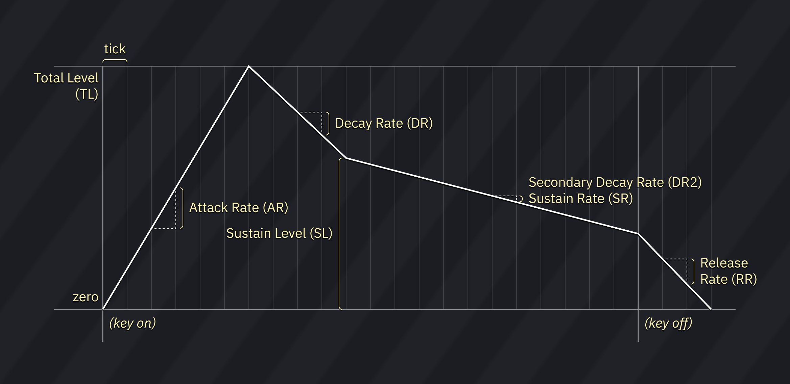

# FM (OPM)乐器编辑器 instrument editor

FM编辑器分为七个选项卡the FM editor is divided into 7 tabs:

- **FM**: 控制FM音源的基本参数for controlling the basic parameters of FM sound source.
- **宏Macros (FM)**:控制算法,反馈,LFO的参数 for macros controlling algorithm, feedback and LFO.
- **宏Macros (OP1)**:控制运算器1的参数的宏 for macros controlling FM parameters of operator 1.
- **宏Macros (OP2)**: 控制运算器2的参数的宏for macros controlling FM parameters of operator 2.
- **宏Macros (OP3)**: 控制运算器3的参数的宏for macros controlling FM parameters of operator 3.
- **宏Macros (OP4)**: 控制运算器4的参数的宏for macros controlling FM parameters of operator 4.
- **宏Macros**:其他的宏(音量/琶音/音高/噪音) for other macros (volume/arp/pitch/noise).

## FM

OPM是四运算器的,意味着他用四个运算器来产生一个单独的音.OPM is four-operator, meaning it takes four oscillators to produce a single sound.

这些参数作用于乐器的整体these apply to the instrument as a whole:

- **反馈Feedback (FB)**:决定运算器1将他的输出的几倍(0~7)返回用来调制自己. determines how many times operator 1 returns its output to itself (0 to 7).

- **算法Algorithm (ALG)**: 决定运算器怎么互相连接(0~7共八种)determines how operators are connected to each other (0 to 7).
  
  - 左键弹出一个小的"operators changes with volume哪些运算器随音量变化?"对话框,每个运算器都可以切换是否随音量变化调节输出幅度.left-click pops up a small "operators changes with volume?" dialog where each operator can be toggled to scale with volume level.
  - 右键切换到一个新音符出触发时产生的波形的预览动画right-click to switch to a preview display of the waveform generated on a new note:
    - 左键重新开始预览left-click restarts the preview.
    - 中键停止/继续播放预览middle-click pauses and unpauses the preview.
    - 右键切换回到算法视图right-click returns to algorithm view.

- **LFO >频率 Freq (FMS)**:决定LFO对频率影响多大 determines how much will LFO have an effect in frequency (0 to 7).

- **LFO >振幅 Amp (AMS)**:决定LFO对音量影响多大 determines how much will LFO have an effect in volume (0 to 3).
  
  - 仅作用于AM打开的运算器only applies to operators which have AM turned on.

这些作用于每个运算器these apply to each operator:

- 交叉箭头的按钮可以拖拽,重新排列运算器的位置.the crossed-arrows button can be dragged to rearrange operators.
- **OP1**, **OP2**, **OP3**, 和**OP4**按钮启用/禁用这些运算器the **OP1**, **OP2**, **OP3**, and **OP4** buttons enable or disable those operators.
- **振幅调制Amplitude Modulation (AM)**:让运算器的音量被LFO作用 makes the operator volume affected by LFO.
- **起音速率Attack Rate (AR)**: 决定声音起始上升的时间.值越大起音速度越快(0~31).determines the rising time for the sound. the bigger the value, the faster the attack (0 to 31).
- **衰减速率Decay Rate (DR)**:决定声音的衰减速率.值越大衰减过程越短.DR是最初振幅的衰减速率.(0~31) determines the diminishing time for the sound. the higher the value, the shorter the decay. it's the initial amplitude decay rate (0 to 31).
- **保持水平Sustain Level (SL)**:决定声音音量结束衰减,并改为具有一个恒定水平时候的幅度.SL表示为最大振幅的 分数。 determines the point at which the sound ceases to decay and changes to a sound having a constant level. the sustain level is expressed as a fraction of the maximum level (0 to 15).
- **衰减速率2 Decay Rate 2 (D2R) / 保持时速率Sustain Rate (SR)**: 决定声音的衰减速率.值越大衰减过程越短.这是声音的长"尾巴",只要按键依然按下不放,这个尾巴就一直继续.determines the diminishing time for the sound. the higher the value, the shorter the decay. this is the long "tail" of the sound that continues as long as the key is depressed (0 to 31). (译者注,其实这个值就作用于Sustain阶段,FM音源(OPL等除外)的ADSR比较特殊,它的sustain阶段不一定保持不变,而是可以有第二段衰减过程,也可以指定DR,所以叫做D2R)
- **释放速率Release Rate (RR)**:决定音符关之后声音消失的速率.值越大释放过程越短.(0~15) determines the rate at which the sound disappears after note off. the higher the value, the shorter the release (0 to 15).
- **总体水平Total Level (TL)**:表示包络的最高振幅,0最大,127(十进制)最小.每个单位的声音变化是大约0.75dB. represents the envelope’s highest amplitude, with 0 being the largest and 127 (decimal) the smallest. a change of one unit is about 0.75 dB.

- **不会翻译Envelope Scale (RS/KS)**:也叫"Key Scale"或"envelope scale".决定随着音高变高,包络的执行速度变快多少(0~3) also known as "Key Scale" or "Rate Scale". determines the degree to which the envelope execution speed increases according to the pitch (0 to 3).
- **倍频Frequency Multiplier (MULT)**: 设置相对音符本身音高的粗略的音高偏移.他们的值遵循泛音列.(0是1/2倍频,其他的数值就代表频率倍数)例如0是低1八度,1是0八度,2是高1八度,3是高一八度加一个纯五度(7半音),以此类推.sets the coarse pitch offset in relation to the note (0 to 15). the values follow the harmonic scale. for example, 0 is -1 octave, 1 is 0 octaves, 2 is 1 octave, 3 is 1 octave 7 semitones, and so on.
- **精细失谐Fine Detune (DT)**:稍稍偏移一下音高 shifts the pitch a little (0 to 7).
- **粗略失谐Coarse Detune (DT2)**: 以10音分为单位偏移音高shifts the pitch by tens of cents (0 to 3).

## 宏macros

这些宏让你精细到tick的时间控制几个FM参数.these macros allow you to control several parameters of FM per tick.

## FM宏 FM Macros

- **算法Algorithm**,
  **反馈Feedback**,
  **LFO > 频率Freq**,
  **LFO > 振幅Amp**: 如上面所示as described above.
- **AM深度AM Depth**: 振幅调制深度amplitude modulation depth.
- **PM深度PM Depth**:音高调制深度 pitch modulation depth.
- **LFO速度LFO Speed**: LFO的频率LFO frequency.
- **LFO波形LFO Shape**: LFO shape. choose between saw, square, triangle, and random.
- **OpMask**:开关每个运算器 toggles each operator.

## OP1-OP4 宏Macros

所有参数都在上面写出了all parameters are listed above.

## 宏Macros

- **琶音Arpeggio**: 音高序列pitch sequence.
- **噪音频率Noise Frequency**: 设置噪音的频率specifies the noise frequency.
  - 这只适用于通道8的operator 4! this only applies to operator 4 of channel 8!
- **声像Panning**:设置左右通道上的输出 toggles output on left and right channels.
- **音高Pitch**:精细的音高 fine pitch.
  - **相对Relative**:当他被启用,音高变化是相对现在的音高设置的. when enabled, pitch changes are relative to the current pitch.
- **相位重置Phase Reset**:重新启动所有运算器,把波形恢复到最开始的相位. restarts all operators and resets the waveform to its start.

## 链接links

这是youtube的生肉,别看了[FM instrument tutorial](https://www.youtube.com/watch?v=wS8edjurjDw): A great starting point to learn how create and work with FM sounds. this was made for DefleMask, but all the same principles apply.
