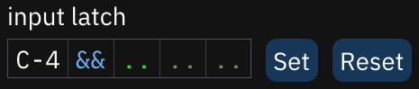

# 输入锁存input latch

输入锁存决定什么数据随同音符输入. 在pattern视图中 这些列是音符, 乐器, 音量, 效果类型, 效果值. input latch determines which data are placed along with a note. as in the pattern view, the columns are note (not changeable), instrument, volume, effect type, and effect value.
- `&&` 填入目前选中的乐器fills in the currently selected instrument.
- `..` 忽略这个列ignores the column.
- 所有列(除了音符)都可以通过一个右键取消all columns (except note) can be reset with a right-click.
- **设置Set**: 按照光标处的数据设置锁存sets latch according to the data found at the cursor.
- **撤销Reset**: 将所有列撤销为默认(选中的乐器,忽略其他)resets all columns to default (selected instrument, ignore others).
- 只有第一个效果类型和效果值被锁存only the first effect type and effect value may be latched.
