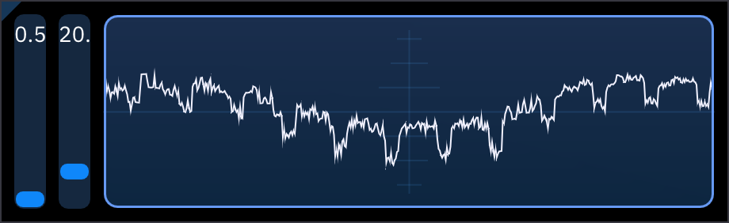

# 示波器oscilloscope

示波器将音频输出显示为波形图the Oscilloscope shows the audio output as a waveform.

右键这个示波器切换调争滑块right-clicking on the oscilloscope toggles adjustment sliders:
- 波形高度waveform height (缩放zoom)
- 窗口大小(显示多长时间内的输出)按毫秒window size (how much of the output to display) in milliseconds.
